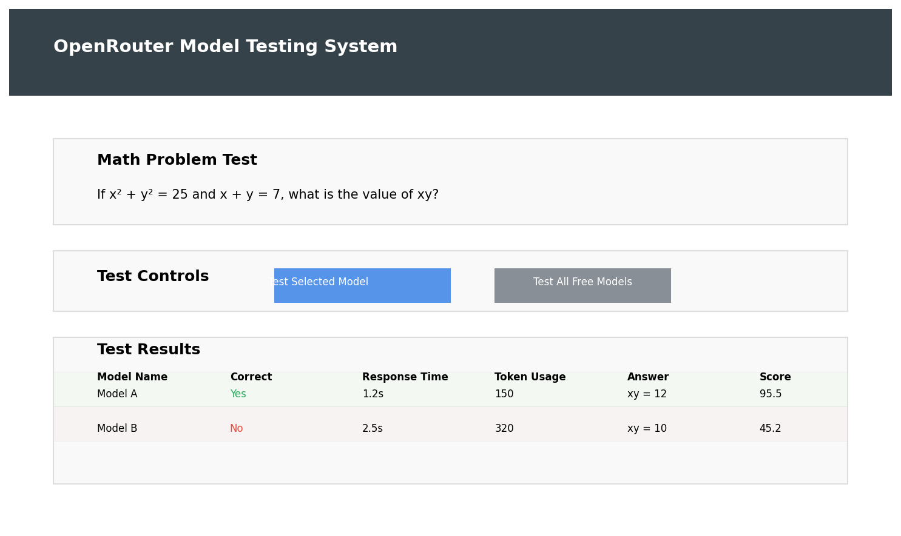

# OpenRouter Model Testing System

<div align="center">
  
  <br>
  <p><strong>Evaluate and compare AI model performance on mathematical reasoning tasks</strong></p>
</div>

## Table of Contents
- [Overview](#overview)
- [Features](#features)
- [Installation](#installation)
  - [Prerequisites](#prerequisites)
  - [Setup Instructions](#setup-instructions)
- [Quick Start](#quick-start)
- [Usage Guide](#usage-guide)
  - [Testing a Single Model](#testing-a-single-model)
  - [Testing Multiple Models](#testing-multiple-models)
  - [Interpreting Results](#interpreting-results)
- [The Math Problem](#the-math-problem)
  - [Problem Statement](#problem-statement)
  - [Solution Explanation](#solution-explanation)
- [Scoring System](#scoring-system)
  - [Correctness (70 points)](#correctness-70-points)
  - [Response Time (20 points)](#response-time-20-points)
  - [Token Efficiency (10 points)](#token-efficiency-10-points)
- [API Documentation](#api-documentation)
  - [Available Endpoints](#available-endpoints)
  - [Response Format](#response-format)
- [Project Structure](#project-structure)
- [Troubleshooting](#troubleshooting)
- [Contributing](#contributing)
- [License](#license)

## Overview

The OpenRouter Model Testing System is a web application designed to evaluate and compare the performance of AI models available through the OpenRouter API. The system focuses on testing models' mathematical reasoning capabilities by presenting them with a specific math problem and scoring their responses based on correctness, response time, and token efficiency.

<div align="center">
  
</div>

## Features

- **Model Selection**: Choose from available free models on OpenRouter
- **Single Model Testing**: Test individual models on the math problem
- **Batch Testing**: Test multiple models simultaneously
- **Real-time Progress**: Track testing progress with live updates
- **Comprehensive Scoring**: Evaluate models based on multiple criteria
- **Interactive Results**: View and compare model performance metrics
- **Responsive Design**: Works on desktop and mobile devices

## Installation

### Prerequisites

- Python 3.8 or higher
- pip (Python package manager)
- OpenRouter API key (get one at [openrouter.ai](https://openrouter.ai))
- Modern web browser (Chrome, Firefox, Safari, or Edge)

### Setup Instructions

1. **Clone the repository**
   ```bash
   git clone https://github.com/yourusername/openrouter-model-testing.git
   cd openrouter-model-testing
   ```

2. **Install required packages**
   ```bash
   pip install -r requirements.txt
   ```

3. **Set up your OpenRouter API key**
   ```bash
   # Linux/macOS
   export OPENROUTER_API_KEY="your-api-key-here"
   
   # Windows (Command Prompt)
   set OPENROUTER_API_KEY=your-api-key-here
   
   # Windows (PowerShell)
   $env:OPENROUTER_API_KEY="your-api-key-here"
   ```

4. **Configure database connection (if needed)**
   The application uses PostgreSQL and defaults to:
   - Host: `localhost`
   - Port: `5432`
   - Database: `testdb`
   - User: `testuser`
   - Password: `testpassword`

   To customize, set these environment variables:
   ```bash
   # Linux/macOS
   export DB_HOST="your-host"
   export DB_PORT="your-port"
   export DB_NAME="your-dbname"
   export DB_USER="your-user"
   export DB_PASSWORD="your-password"
   
   # Windows (PowerShell)
   $env:DB_HOST="your-host"
   $env:DB_PORT="your-port"
   $env:DB_NAME="your-dbname"
   $env:DB_USER="your-user"
   $env:DB_PASSWORD="your-password"
   ```

5. **Configure LangSmith tracing (for test environment)**
   To enable LangSmith tracing in test environment, set these variables:
   ```bash
   # Linux/macOS
   export LANGSMITH_TRACING="true"
   export LANGSMITH_ENDPOINT="https://api.smith.langchain.com"
   export LANGSMITH_API_KEY="your-langsmith-api-key"
   export LANGSMITH_PROJECT="your-langsmith-project"
   
   # Windows (PowerShell)
   $env:LANGSMITH_TRACING="true"
   $env:LANGSMITH_ENDPOINT="https://api.smith.langchain.com"
   $env:LANGSMITH_API_KEY="your-langsmith-api-key"
   $env:LANGSMITH_PROJECT="your-langsmith-project"
   ```

6. **Start the application**
   ```bash
   ./start_app.sh
   ```
   Or on Windows:
   ```bash
   python app.py
   ```

5. **Access the application**
   
   Open your web browser and navigate to: http://localhost:5002

## Quick Start

For those who want to get up and running immediately:

1. **Install Python 3.8+** if not already installed
2. **Run the following commands**:
   ```bash
   pip install flask requests
   export OPENROUTER_API_KEY="your-api-key-here"
   ./start_app.sh
   ```
3. **Open** http://localhost:5002 in your browser
4. **Select a model** from the dropdown and click "Test Selected Model"

## Usage Guide

### Testing a Single Model

1. Select a model from the dropdown menu
2. Click "Test Selected Model"
3. Wait for the test to complete
4. View the results in the table below

### Testing Multiple Models

1. Click "Test All Free Models"
2. Watch the progress indicator as models are tested
3. Results will appear in the table as each test completes
4. The final results will be sorted by score

### Interpreting Results

The results table shows:
- **Model Name**: The name of the tested model
- **Correct**: Whether the model provided the correct answer
- **Response Time**: How long the model took to respond (in seconds)
- **Token Usage**: The number of tokens used (prompt + completion)
- **Answer**: The answer extracted from the model's response
- **Score**: The overall score (out of 100)

## The Math Problem

### Problem Statement

The system tests models on the following mathematical problem:

> If x² + y² = 25 and x + y = 7, what is the value of xy?

### Solution Explanation

To solve this problem, we need to find the value of xy given the two equations:
1. x² + y² = 25
2. x + y = 7

Step 1: Square the second equation.
(x + y)² = 7²
x² + 2xy + y² = 49

Step 2: Substitute the first equation.
x² + y² + 2xy = 49
25 + 2xy = 49

Step 3: Solve for xy.
2xy = 49 - 25
2xy = 24
xy = 12

Therefore, the correct answer is 12.

## Scoring System

Models are evaluated based on three criteria:

### Correctness (70 points)

- **70 points**: The model provides the correct answer (12)
- **0 points**: The model provides an incorrect answer or no clear answer

The system uses regex pattern matching to identify the correct answer in the model's response.

### Response Time (20 points)

- **20 points**: Response time ≤ 1 second
- **15 points**: Response time ≤ 2 seconds
- **10 points**: Response time ≤ 3 seconds
- **5 points**: Response time ≤ 4 seconds
- **0 points**: Response time > 4 seconds

### Token Efficiency (10 points)

- **10 points**: Total tokens ≤ 100
- **8 points**: Total tokens ≤ 200
- **6 points**: Total tokens ≤ 300
- **4 points**: Total tokens ≤ 400
- **2 points**: Total tokens ≤ 500
- **0 points**: Total tokens > 500

## API Documentation

### Available Endpoints

- **GET /api/models**
  - Returns a list of available free models
  - Example response:
    ```json
    {
      "models": [
        {
          "id": "google/gemma-7b-it:free",
          "name": "Gemma 7B Instruct",
          "provider": "Google"
        },
        ...
      ]
    }
    ```

- **POST /api/test**
  - Tests a single model
  - Request body:
    ```json
    {
      "model_id": "google/gemma-7b-it:free"
    }
    ```
  - Example response:
    ```json
    {
      "model_name": "Gemma 7B Instruct",
      "correct": true,
      "response_time": 2.34,
      "token_usage": {
        "prompt": 45,
        "completion": 120,
        "total": 165
      },
      "answer": "12",
      "score": 91
    }
    ```

- **GET /api/test-all**
  - Tests all available free models
  - Returns a stream of Server-Sent Events (SSE)
  - Each event contains a result similar to the /api/test endpoint

### Response Format

All API responses are in JSON format. Error responses include an `error` field with a description of the error.

## Project Structure

```
openrouter-model-testing/
├── app.py                  # Main Flask application
├── openrouter_client.py    # OpenRouter API client
├── start_app.sh            # Startup script
├── requirements.txt        # Python dependencies
├── static/                 # Static files
│   ├── css/                # CSS stylesheets
│   │   └── style.css       # Main stylesheet
│   ├── js/                 # JavaScript files
│   │   └── main.js         # Main JavaScript file
│   └── img/                # Images and icons
│       ├── logo.png        # Application logo
│       └── favicon.ico     # Favicon
├── templates/              # HTML templates
│   └── index.html          # Main page template
└── README.md               # This file
```

## Troubleshooting

### Common Issues

1. **API Key Error**
   - **Symptom**: "Invalid API key" error message
   - **Solution**: Ensure your OpenRouter API key is correctly set as an environment variable

2. **Model Not Found**
   - **Symptom**: "Model not found" error when testing
   - **Solution**: Refresh the model list by reloading the page

3. **Slow Response Times**
   - **Symptom**: Tests take a long time to complete
   - **Solution**: Some models naturally take longer to respond. Try testing with different models.

4. **No Free Models Available**
   - **Symptom**: No models appear in the dropdown
   - **Solution**: Check your OpenRouter account to ensure you have access to free models

5. **Application Won't Start**
   - **Symptom**: Error when running start_app.sh
   - **Solution**: Check flask_output.log for details. Ensure Python and required packages are installed.

5. **Database Connection Error**
   - **Symptom**: "could not translate host name ..." or other database errors
   - **Solution**:
       - Ensure PostgreSQL is running
       - Check your database configuration (see step 4 above)
       - Verify the database credentials and network access

## Contributing

Contributions are welcome! Please feel free to submit a Pull Request.

## License

This project is licensed under the MIT License - see the LICENSE file for details.